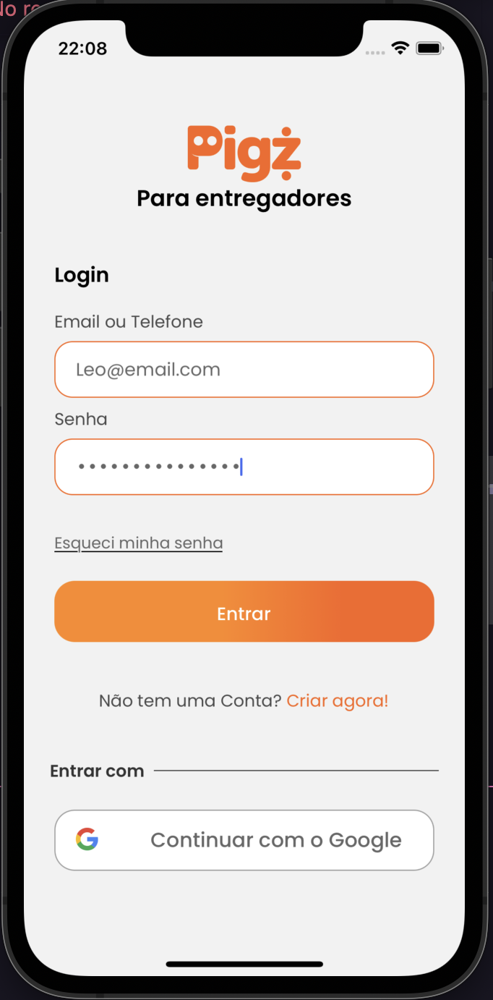
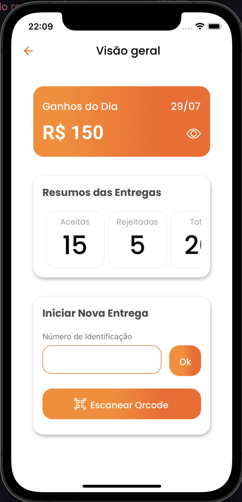
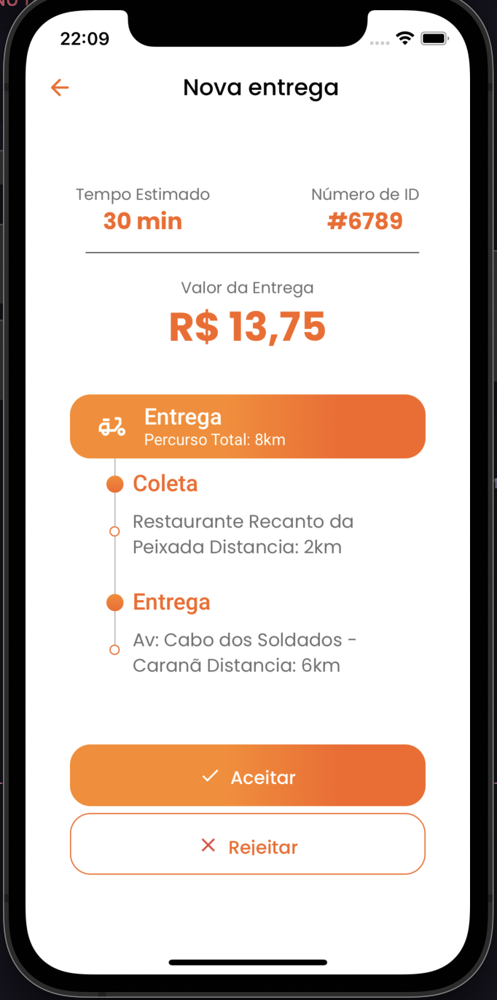

<h1 align="center">📱 Desafio FrontEnd Mobile Pigz</h1>
<h4 align="center" style="margin-bottom:30px"> 
	 Desafio de criação de app de Delivery 
</h4>

 <a href="#objetivo">Objetivo</a> •
 <a href="#tecnologias">Tecnologias</a> •
 <a href="#image">Prototipo Atual</a> • 
 <a href="https://github.com/leouluz">Autor-Leonardo</a>

  <h1 align="center">🚀 Objetivo do Desafio</h1>
  
 O desafio consiste em desenvolver as primeiras telas de um aplicativo de entrega.

  <a href="https://github.com/orangebr/vagas/tree/main/desafios/desafio-frontend-mobile-pigz">Link de Referencia</a>

  <h1 align="center" >⚡️ Tecnologias</h1>
  
 Estou trabalhando com React-Native com Expo

  
Acesse a documentação abaixo:

  

    <a href="https://reactnative.dev/">React-native</a>
  

  

    <a href="https://docs.expo.io/">Expo</a>
  

  <h1 align="center">✨ Telas desenvolvidas</h1>
  

    
    
    
  

